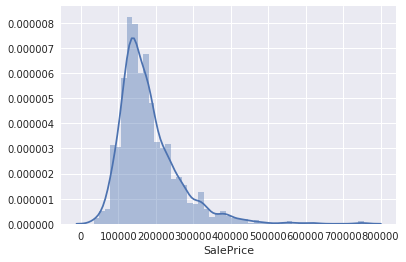
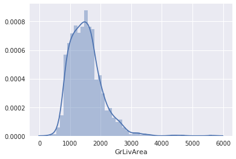

# 3 Univariate Analysis


```python
import pandas as pd
import numpy as np
df = pd.read_csv('train.csv')
```

### Analyze the target variable SalePrice

Show the average, min, max SalePrice


```python
df['SalePrice'].describe()
```


    count      1460.000000
    mean     180921.195890
    std       79442.502883
    min       34900.000000
    25%      129975.000000
    50%      163000.000000
    75%      214000.000000
    max      755000.000000
    Name: SalePrice, dtype: float64


We can inspect the distribution of SalePrice.


```python
import seaborn as sns
import warnings
warnings.filterwarnings('ignore') # to suppress a numpy warning
%matplotlib inline
```


```python
sns.distplot(df.SalePrice);
```





So we can observe that SalePrice:
- Deviates from the normal distribution
- Has a positive skewness (peak is left of center)
- Shows peakedness (kurtosis) (is more pointy than a normal distribution)


```python
# We can also show skewness and kurtosis in numbers
# A normal dist has skewness=0, skewness < 0 mean is right-skewed, skewness > 0 mean left-skewed
# A normal dist has kurtosis=3, kurtosis < 3 mean flat-topped and low-tailed, kurtosis > 3 mean peak and fat-tailed
print("Skewness: %f" % df.SalePrice.skew())
print("Kurtosis: %f" % df.SalePrice.kurt())
```

    Skewness: 1.882876
    Kurtosis: 6.536282


In general, you want to analyze whether continuous variables follow a Normal distribution and transform them if they are not (up next).

#### Assignment: Analyze the variable GrLivArea.


```python
print(df.GrLivArea.describe())
sns.distplot(df.GrLivArea)
print("Skewness: %f" % df.GrLivArea.skew())
print("Kurtosis: %f" % df.GrLivArea.kurt())
```

    count    1460.000000
    mean     1515.463699
    std       525.480383
    min       334.000000
    25%      1129.500000
    50%      1464.000000
    75%      1776.750000
    max      5642.000000
    Name: GrLivArea, dtype: float64
    Skewness: 1.366560
    Kurtosis: 4.895121




