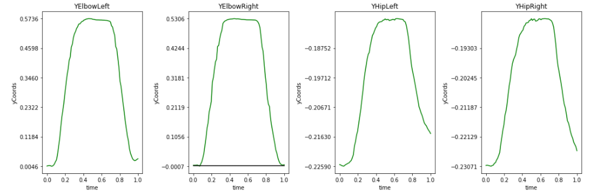

# Notebooks
In het project hebben we gewerkt op de jupyter hub waarop we python notebooks konden aanmaken om data analyse te doen. Tijdens het project heb ik verschillende notebooks gemaakt, waarvan ik hieronder een beschrijving heb neergezet met het resultaat erbij. Daarnaast heb ik aandacht besteed aan het leren programmeren van de groepgenoten die niet bij de opleiding informatica zaten. Wat code betreft denk ik dat het duidelijker is om te laten zien welke resultaten ik verkregen heb en niet u op te zadelen met het uitvogelen van mijn code.

## Eigen notebooks
In mijn eigen notebooks heb ik me bezich gehouden met:
* Het uitlezen van data uit de dataset.
* Grafieken maken
* Data filteren
* Clusteren

### Uitlezen van data
In het begin van het project bestond er nog geen manier om de juiste data uit de dataset te halen per persoon, per oefening, per jointName. Hier heb ik een stukje code voor geschreven. 

### Grafieken maken
Nadat de dataset online was gezet heeft iedereen van de groep de tijd gekregen om deze te verkennen. Hierbij ging het om het tonen van grafieken met de dataset. Hierbij heb ik een aantal soorten grafieken gemaakt. Hieronder staan een aantal grafieken met een korte beschrijving erbij.

In bovenstaande figuur zie je van boven naar beneden de X, Y en Z grafieken. Hierbij is van links naar rechts te zien: coordinaten, snelheid en versnelling. Ik had mijn code zo geschreven dat dit in bulk uitgevoerd kon worden. Daarbij was de range in personen, excersises en joints zelf te configureren.

Verder heb ik nog een algoritme gemaakt om te kijken naar de heupen die bewegen op het moment dat iemand zijn omhoog doet tijdens oefening 1 en 2. Bovenstaand plaatje laat zien wat de elleboog coordinaten en de heup coordinaten zijn.

Hier heb ik samen met laura naar gekeken. Dit zijn de bovenarm lengtes berekend van schouderjoint tot elleboogjoint. Deze varieerd tijdens de oefening en wij wilde weten hoeveel(oefening 1). Dit was voor persoon 4 en 5 waarbij er een duidelijk een variatie in te zien is.

## Hulp bij anderen
Niet alleen heb ik anderen geholpen met het leren programmeren, ook heb ik samen gewerkt met anderen om bepaalde producten tot stand te brengen. Denk bijvoorbeeld aan het treintje en het clusteren samen met Laura.

Ik heb Robin en Jordy een aantal keer geholpen bij het project omdat ik denk dat het voor niet informatica mensen ook leuk is als ze ervaren hoe het is om iets te programmeren. Ik heb in het vroege stadium van het project met Robin gezeten om te kijken of we grafieken konden plotten voor oefening 2. Samen met Jordy heb ik gekeken naar zijn Datacamp opdrachten en naar clustering. Het resultaat van het clusteren is de volgende afbeelding, hierop is te zien hoe de maximale hoek van de linkerarm tegenover de maximale hoek van de rechterarm staat bij de 3e oefening.

Naast het helpen van mensen heb ik ook gekeken of ik met pairprogramming sneller vooruit kon komen. Dit heb ik vooral samen met Laura gedaan. We hebben samen een clustering gedaan op de eerste oefening waarbij we keken naar de uitwijking die mensen hadden in de z-as. We hebben hierbij met interpolaties kunnen berekenen welke uitwijking mensen in de z-as hadden op verschillende hoogtes tijdens de eerste oefening. Hiervoor hebben we naar de hoogte hoek gekeken die de elleboog had ten opzichte van de schouder en spine mid.
